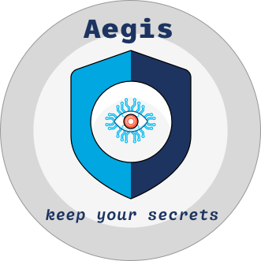

## Aegis Go SDK

Aegis SDK for Go language. 

This SDK enables workloads to directly communicate with Aegis Safe instead
of using a sidecar.

[Check out Aegis’ README][aegis-readme] for more information about the project, 
high level design, contributing guidelines, and code of conduct.

[aegis]: https://github.com/zerotohero-dev/aegis "Aegis"
[aegis-readme]: https://github.com/zerotohero-dev/aegis/blob/main/README.md "Aegis README"
